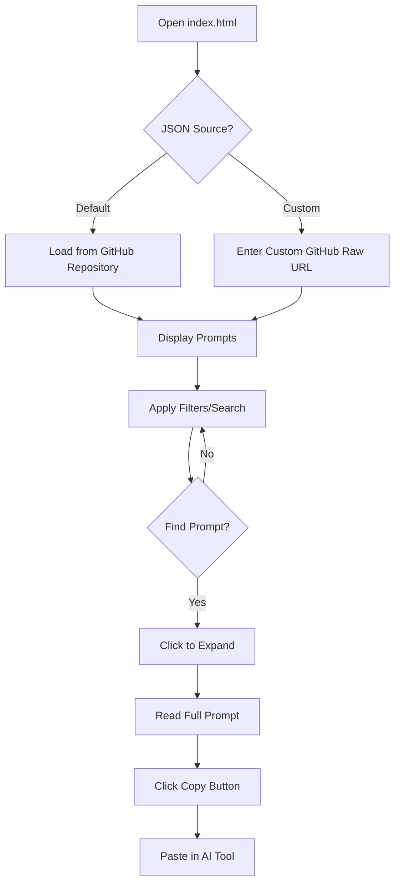
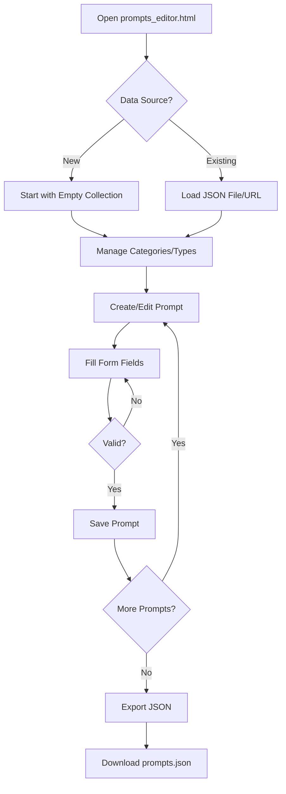
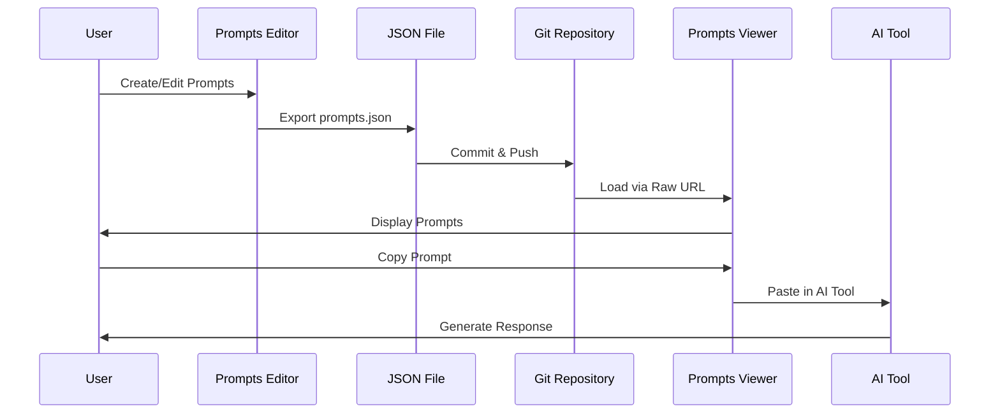

# xsukax AI Prompts

A lightweight, privacy-focused web application for managing, viewing, and organizing AI prompts. This tool provides a professional interface for browsing prompt collections and editing them locally without requiring any server-side infrastructure or external dependencies.

## Project Overview

**xsukax AI Prompts** is a client-side web application designed to streamline the management of AI prompts for developers, researchers, and AI enthusiasts. The application consists of two primary components:

1. **Prompts Viewer** (`index.html`) - A sophisticated browser interface for viewing, searching, and filtering AI prompts from JSON data sources
2. **Prompts Editor** (`prompts_editor.html`) - A comprehensive editor for creating, modifying, and exporting prompt collections

Both components operate entirely in the browser, requiring no backend infrastructure, databases, or external API calls. Users can load prompts from GitHub raw URLs or local JSON files, making it an ideal solution for open-source prompt sharing and collaborative prompt engineering.

## Security and Privacy Benefits

This application prioritizes user security and privacy through its architectural design:

- **100% Client-Side Execution**: All processing occurs in the user's browser with no data transmission to external servers
- **No External Dependencies**: Does not require npm packages, CDN resources, or third-party libraries that could compromise security
- **No Data Collection**: Zero telemetry, analytics, or tracking mechanisms implemented
- **No Authentication Required**: No user accounts, passwords, or personal information needed
- **Local-First Architecture**: Users maintain complete control over their data, which never leaves their device unless explicitly exported
- **CORS-Friendly Design**: Safely loads JSON data from GitHub raw URLs without exposing credentials
- **No Server-Side Processing**: Eliminates server-side vulnerabilities and attack vectors
- **Transparent Code**: Pure HTML, CSS, and JavaScript with no obfuscation or minification for complete code auditability
- **Offline Capable**: Once loaded, the application can function without internet connectivity (except for loading remote JSON files)

## Features and Advantages

### Prompts Viewer (`index.html`)
- **Dynamic JSON Loading**: Load prompt collections from any GitHub raw JSON URL or custom sources
- **Advanced Filtering**: Filter prompts by category, type, and search queries simultaneously
- **Real-Time Search**: Instant search across prompt titles, excerpts, and full content
- **Interactive UI**: Expandable prompt cards with smooth animations and responsive design
- **One-Click Copy**: Copy prompts to clipboard with visual feedback
- **Statistics Dashboard**: Real-time statistics showing total prompts, categories, types, and filtered results
- **Type Badges**: Visual categorization with color-coded badges for different prompt types (Text, Image, Audio, Video, Structured)
- **Character and Line Count**: Detailed metadata for each prompt
- **Mobile-Responsive**: Fully functional on desktop, tablet, and mobile devices
- **GitHub-Inspired Design**: Professional, clean interface following modern design principles

### Prompts Editor (`prompts_editor.html`)
- **Intuitive Editor**: Full-featured form-based editor for creating and modifying prompts
- **Category Management**: Add, edit, and delete categories with automatic prompt reassignment
- **Type Management**: Manage prompt types (Text, Image, Video, Audio, Structured) with usage tracking
- **JSON Import/Export**: Load existing JSON files and export modified collections
- **Local File Support**: Import JSON files directly from your local filesystem
- **Live Statistics**: Real-time counters for prompts, categories, and types
- **Character Counter**: Live character count for prompt content
- **Sidebar Navigation**: Quick access to all prompts with active state indication
- **Form Validation**: Ensures all required fields are completed before saving
- **Confirmation Dialogs**: Prevents accidental deletion of prompts, categories, or types
- **Unsaved Changes Warning**: Notifies users of unsaved modifications

### Common Benefits
- **No Installation Required**: Runs directly in any modern web browser
- **Cross-Platform Compatibility**: Works on Windows, macOS, Linux, iOS, and Android
- **Fast Performance**: Lightweight codebase with optimized rendering
- **Accessibility**: Keyboard navigation support and semantic HTML structure
- **JSON Format**: Uses standard JSON for maximum compatibility and portability
- **Version Control Friendly**: Plain JSON files integrate seamlessly with Git workflows
- **Self-Hosting Ready**: Deploy on GitHub Pages, Netlify, Vercel, or any static hosting service

## Installation Instructions

### Option 1: Direct Usage (Recommended)
1. Clone the repository:
   ```bash
   git clone https://github.com/xsukax/xsukax-AI-Prompts.git
   ```

2. Navigate to the project directory:
   ```bash
   cd xsukax-AI-Prompts
   ```

3. Open the desired HTML file in your web browser:
   - **For viewing prompts**: Open `index.html`
   - **For editing prompts**: Open `prompts_editor.html`

### Option 2: Deploy to GitHub Pages
1. Fork the repository on GitHub

2. Go to repository Settings → Pages

3. Under "Source", select the branch (usually `main`) and folder (`/root`)

4. Click "Save" and wait for deployment (usually 1-2 minutes)

5. Access your deployed application at:
   ```
   https://yourusername.github.io/xsukax-AI-Prompts/
   ```

### Option 3: Local Web Server
For enhanced functionality (especially with local JSON files), run a local web server:

```bash
# Using Python 3
python -m http.server 8000

# Using Python 2
python -m SimpleHTTPServer 8000

# Using Node.js (requires http-server package)
npx http-server -p 8000

# Using PHP (requires php.ini configuration for optimal performance)
php -S localhost:8000
```

Then access the application at `http://localhost:8000`

**Note**: For PHP users, ensure your php.ini configuration allows adequate memory_limit and max_execution_time for handling large JSON files.

### System Requirements
- **Browser**: Any modern web browser (Chrome 90+, Firefox 88+, Safari 14+, Edge 90+)
- **Operating System**: Windows 7+, macOS 10.13+, Linux (any recent distribution), iOS 14+, Android 8+
- **Storage**: Minimal (under 1MB for application files)
- **Network**: Internet connection only required for loading remote JSON files

## Usage Guide

### Using the Prompts Viewer



#### Step-by-Step Instructions:

1. **Load Prompts**:
   - The application automatically loads prompts from the default repository URL
   - To load from a different source, paste a GitHub raw JSON URL into the input field and click "Load Prompts"
   - Supported URL format: `https://raw.githubusercontent.com/username/repo/branch/file.json`

2. **Browse Prompts**:
   - All available prompts are displayed as cards
   - Each card shows the title, type badge, category badge, excerpt, and metadata

3. **Search and Filter**:
   - Use the search box to find prompts by title or content
   - Select a category from the dropdown to filter by category
   - Select a type from the dropdown to filter by type (Text, Image, Audio, Video, Structured)
   - Click category or type chips for quick filtering
   - Filters can be combined for precise results

4. **View Full Prompts**:
   - Click on any prompt card to expand and view the complete prompt text
   - The card will highlight with a blue border when active
   - Click the same card again to collapse it

5. **Copy Prompts**:
   - Click the "Copy" button within an expanded prompt
   - The prompt text is copied to your clipboard
   - A "✓ Copied!" confirmation appears briefly

6. **Monitor Statistics**:
   - View total prompts, categories, and types in the statistics bar
   - See the current count of displayed prompts based on active filters

### Using the Prompts Editor



#### Step-by-Step Instructions:

1. **Initialize the Editor**:
   - Open `prompts_editor.html` in your browser
   - Choose to start with an empty collection or load existing data

2. **Load Existing Prompts** (Optional):
   - **From File**: Click "Load from File" and select a local JSON file
   - **From URL**: Enter a GitHub raw JSON URL and click "Load from URL"

3. **Manage Categories and Types**:
   - **Add Category**: Type a category name in the input field under "Categories" and click "Add"
   - **Add Type**: Type a type name in the input field under "Types" and click "Add"
   - **Delete**: Click the "×" button next to any category or type (prompts using deleted items will need reassignment)

4. **Create a New Prompt**:
   - Click the "+ New Prompt" button in the header
   - The editor form will appear with empty fields

5. **Edit the Prompt**:
   - **Title**: Enter a descriptive title (required)
   - **Category**: Select from dropdown (must be added first)
   - **Type**: Select from dropdown (must be added first)
   - **Excerpt**: Write a brief summary (2-3 sentences recommended)
   - **Prompt**: Enter the complete prompt text
   - Character count updates automatically as you type

6. **Save the Prompt**:
   - Click "Save Prompt" to add it to the collection
   - The prompt appears in the sidebar list
   - A success notification confirms the save

7. **Edit Existing Prompts**:
   - Click any prompt in the sidebar to load it into the editor
   - Modify any fields as needed
   - Click "Save Prompt" to update

8. **Delete a Prompt**:
   - Load the prompt you want to delete
   - Click "Delete Prompt"
   - Confirm the deletion in the dialog

9. **Export Your Collection**:
   - Click "Export JSON" in the header
   - The browser downloads a `prompts_[timestamp].json` file
   - This file can be:
     - Uploaded to GitHub for use with the viewer
     - Shared with team members
     - Imported back into the editor
     - Version controlled with Git

### JSON File Structure

The application uses a standardized JSON format for prompt collections:

```json
[
  {
    "id": 1,
    "title": "Your Prompt Title",
    "category": "Category Name",
    "type": "Text",
    "excerpt": "A brief description of what this prompt does",
    "prompt": "The complete prompt text goes here"
  }
]
```

**Field Descriptions**:
- `id` (number): Unique identifier for the prompt
- `title` (string): The prompt's display title
- `category` (string): Classification category (e.g., "Coding", "Writing", "Analysis")
- `type` (string): Prompt type - must be one of: "Text", "Image", "Video", "Audio", "Structured"
- `excerpt` (string): Short summary displayed in the viewer
- `prompt` (string): The full prompt text that users will copy

### Workflow Integration



### Best Practices

1. **Consistent Categorization**: Use clear, consistent category names across all prompts
2. **Descriptive Titles**: Write titles that clearly indicate the prompt's purpose
3. **Quality Excerpts**: Provide helpful excerpts that allow users to quickly identify relevant prompts
4. **Version Control**: Commit your JSON files to Git to track changes over time
5. **Regular Backups**: Export and backup your prompt collections regularly
6. **Modular Organization**: Consider maintaining separate JSON files for different domains or use cases
7. **Testing**: Always test prompts in the viewer after editing to ensure proper formatting
8. **Collaboration**: Share your GitHub repository URL with team members for easy access

## Licensing Information

This project is licensed under the GNU General Public License v3.0.

## Contributing

Contributions are welcome! Please feel free to submit pull requests, report issues, or suggest enhancements through the GitHub repository.

## Support

For questions, issues, or feature requests, please open an issue on the [GitHub repository](https://github.com/xsukax/xsukax-AI-Prompts).

---

**Created by xsukax** | [GitHub Repository](https://github.com/xsukax/xsukax-AI-Prompts)
